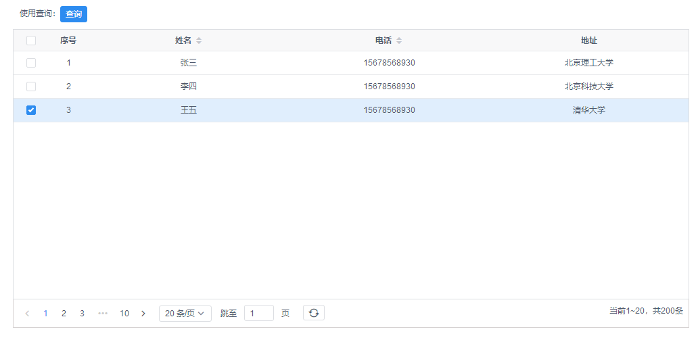

# iview-tables-chg

>结合了iView的 tables 和 page组件，实现类似easyUI的表格效果，只需要设置column、data和total即可以展示
>带分页的表格，毕竟当数据量比较多的时候还是需要分页

## 示例



## 安装

Use npm:

```shell
npm i iview-tables-chg
```


## 使用

全局引入
```javascript
import Vue from 'vue'
import iView from 'iview'
import 'iview/dist/styles/iview.css';
import ChgTables from 'iview-tables-chg'

Vue.use(ChgTables)
```

Or

在需要使用的界面按需引用
```javascript
import ChgTables from 'iview-tables-chg'

 export default {
    name: '',
    components: {
      ChgTables
    },

```


## API

这里关于表格的属性和事件只列出新增和有别于iview的属性，其他的属性和事件都可以设置，参考[iview table参考文档](https://www.iviewui.com/components/table#API)。
row-class-name不建议再另外设置了，不然会影响封装实现的一些样式；
### Table Attributes

| 属性 | 说明 | 类型 | 参数 | 默认值 |
| ---- | ---- | ---- | ---- | ---- |
| prop-data | 表格的数据 | Array | - | [] |
| columns | 列配置，参照iview表格组件，索引列和多选无需配置 | Array | - | [] |
| total | 数据总数 | Number | - | 0 |
| show-index | 是否显示索引列 | Boolean | - | false |
| show-selection | 是否显示多选框，显示时单击即选中该行 | Boolean | - | false |
| show-elevator | 是否显示页码电梯，可以快速切换到某一页 | Boolean | - | true |
| show-page | 是否显示分页 | Boolean | - | true |
| size-text-font-size | 右下角页码描述字体大小 | String | - | '14px' |
| pager-page-size | 分页每页显示数据条数 | Number | - | 50 |
| pager-page-size-opts | 分页每页大小切换配置 | Array | - | [20, 50, 80, 100] |
| highlight-row | iview表格自带，单击时可以高亮选中，在show-selection为true时无效 | Boolean | - | false |

### Table Methods

| 方法名 | 说明 | 参数 | 返回值 |
| ---- | ---- | ---- | ---- |
| getParams | 获取表格参数，页数页码等 | - | Object, {pageSize, pageIndex, sortKey, sortType(desc, asc, normal)} |
| search | 根据筛选条件刷新表格数据，页码重置为第一页，一般用于搜索 | - | - |
| getSelects | 获取选中的行数据 | - | Array |

## 扩展
>如果有其他小伙伴们需要扩展现有的功能，可以download源代码：
https://github.com/connie1992/iview-tables-chg
npm run dev：开发环境
npm run build：编译源文件，npm上传需要在每次修改源码之后需要build一下，这样别人在通过npm安装使用时修改才能生效；

>npm ：https://www.npmjs.com/package/iview-tables-chg
